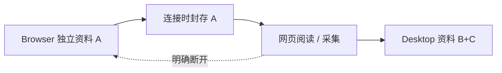

<picture><source media="(prefers-color-scheme: dark)" srcset="https://raw.githubusercontent.com/leximeet/leximeet.github.io/main/docs/public/brand/logo-dark.png"></picture>

# 在语境里遇见单词，在练习里留下记忆

**词遇 LexiMeet** 是一组本地优先的单词学习工具。阅读时保存单词所在的真实句子，学习时主动回忆。桌面端提供完整工作区，浏览器插件保留轻便的网页入口，方便你遇见和记录单词。你也可以不设置学习计划，只把它当作自己的单词本。

[开始使用](https://github.com/leximeet/leximeet.github.io/blob/main/docs/使用文档/快速开始.md) · [产品与功能](https://github.com/leximeet/leximeet.github.io/blob/main/docs/设计文档/功能设计.md) · [整体架构](https://github.com/leximeet/leximeet.github.io/blob/main/docs/设计文档/系统架构.md) · [参与开发](https://github.com/leximeet/leximeet.github.io/blob/main/docs/开发文档/开发入口.md)

## 选择自己的使用方式

| 你想做什么                         | 选择                                                             | 日常流程                                     |
| ---------------------------------- | ---------------------------------------------------------------- | -------------------------------------------- |
| 整理单词、笔记和学习，使用系统通知 | [Desktop](https://github.com/leximeet/leximeet-desktop)          | 记录遇见 → 词库 → 六种练习 → 复习            |
| 在浏览器内独立阅读和学习           | [Browser](https://github.com/leximeet/leximeet-browser) 独立运行 | 词卡 / 侧栏 / 浮球采集 → 浏览器工作区        |
| 网页采集，桌面统一管理             | Browser 连接 Desktop                                             | 一键邀请、真实确认 → 查桌面资料 → 采集到桌面 |
| 按词书系统学习                     | 可选学习规划                                                     | 目标 + 每天新学 / 复习 → 今日任务            |

积分 0–30 表示熟悉程度：首次达到 20 时完成初学，达到 30 时进入休息期。FSRS 提供自动复习的时间建议，你仍可随时主动练习。采集、普通阅读和发音本身不计分。详见[学习规则说明](https://github.com/leximeet/leximeet.github.io/blob/main/docs/设计文档/数据与学习规则.md)。

## 连接时，资料属于谁

浏览器独立资料 **A** 与桌面资料 **B** 分别保存在各自工作区中。连接后，浏览器封存 A，网页读写改用桌面资料，新增的 **C** 也留在桌面。明确断开后恢复 A，桌面保留 B+C。临时失联时，浏览器等待连接恢复，不会自动切换资料；本机连接也不会自动合并两份历史。

<!-- leximeet-diagram: figure-0e83982cf6-01 -->
<picture>
  <source media="(prefers-color-scheme: dark)" srcset="../docs/diagrams/rendered/figure-0e83982cf6-01.dark.svg">
  
</picture>

查看和编辑 Mermaid 源码

[图源文件](../docs/diagrams/figure-0e83982cf6-01.mmd)

<!-- /leximeet-diagram -->

## 开源项目如何分工

| 项目                                                              | 当前职责                                            | 适合贡献                           |
| ----------------------------------------------------------------- | --------------------------------------------------- | ---------------------------------- |
| [Desktop](https://github.com/leximeet/leximeet-desktop)           | 桌面界面、剪贴板、通知、发音、本机连接网关          | UI、系统适配、应用交互             |
| [Desktop Core](https://github.com/leximeet/leximeet-desktop-core) | Java / SQLite 事务、学习规则、FSRS、冻结判题和授权  | 领域规则、数据一致性、可靠恢复     |
| [Browser](https://github.com/leximeet/leximeet-browser)           | 网页阅读器、独立应用服务、桌面 Reading/Capture 适配 | 扩展界面、网页兼容、独立与连接测试 |
| [Dictionary](https://github.com/leximeet/leximeet-dictionary)     | 可校验的 Lite / Core / Full 公共资源，当前 0.0.3    | 数据质量、来源许可、可复现构建     |
| [LMCP](https://github.com/leximeet/leximeet-connector-protocol)   | 本机连接的消息、权限、预算、回执和版本边界          | 接入文档、正反样例、适配器         |
| [LMSP](https://github.com/leximeet/leximeet-sync-protocol)        | 2.0.0 独立设备云同步规划                            | 未来事件与冲突方案；尚无上线服务   |
| [IDEA](https://github.com/leximeet/leximeet-idea)                 | IDE 插件工程骨架                                    | 后续编辑器词卡与采集；业务尚未实现 |
| [文档站](https://github.com/leximeet/leximeet.github.io)          | 产品、使用、设计与开发的中文学习路径                | 例子、可读图解、真实操作说明       |

桌面与浏览器的接口不需要复制全部业务：LMCP 1.0.0 公开阅读、采集、连接控制和固定导航；学习规划、FSRS、练习和笔记编辑在所属工作区完成。各插件按实际实现注册自己的宿主能力，并逐项取得授权。[部署与扩展](https://github.com/leximeet/leximeet.github.io/blob/main/docs/设计文档/部署与扩展.md)说明如何接入另一个插件。

## 版本、隐私与贡献

首次正式版本 **1.0.0** 的范围是本机学习与插件连接，账号和独立设备云同步属于 2.0.0 路线。实际验证主要覆盖 macOS 与隔离 Chromium。下载安装、签名、其他平台与商店状态，以各仓库发布记录为准；组织首页不代表这些渠道已经上线。

个人单词和学习记录保存在本地。采集时默认脱敏、限制单句长度，并检查七天内是否已有相同语境。这些规则不能识别所有秘密，公开报告中请勿上传私人剪贴板、令牌或用户数据库。在线发音会向所选服务发送词头。

欢迎报告可复现的问题、修订文档，或提交经过测试的改进。请先阅读目标仓库的 CONTRIBUTING；修改公共规则时核对两端实现与协议，并分别记录单元测试、真实 Native 测试、源码联调和实际包测试的结果。共用说明：[贡献](../CONTRIBUTING.md)、[安全](../SECURITY.md)、[支持](../SUPPORT.md)、[行为准则](../CODE_OF_CONDUCT.md)。

自有代码和文档采用 **AGPL-3.0-only**；词典来源、音频和第三方依赖保留原许可。许可证范围与素材出处见[许可说明](https://github.com/leximeet/leximeet.github.io/blob/main/docs/设计文档/隐私与许可.md)。
